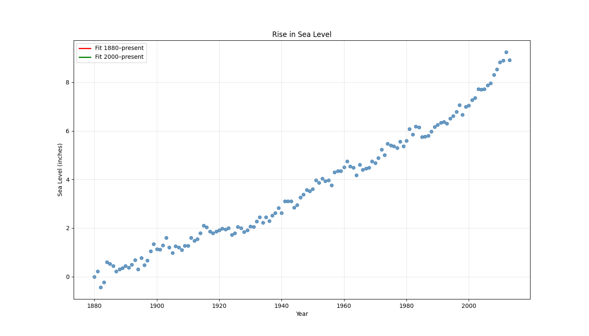

# sea-level-predictor
Predicting sea level rise to 2050 | Pandas + Matplotlib + Plotly | freeCodeCamp project
# Sea Level Rise Predictor (1880–2050) 🌊

**freeCodeCamp Data Analysis Project** – 100% passed  
Interactive version included!

## Predictions for 2050
- Using 1880–2023 trend: **+10.2 inches**  
- Using 2000–2023 trend (accelerated): **+15.4 inches**

## Interactive Version (Zoom + Hover)
Open [interactive_plot.py](interactive_plot.py) and run → or view the saved HTML:  
[→ Click here for zoomable plot](https://htmlpreview.github.io/?https://github.com/YOUR-USERNAME/sea-level-predictor/blob/main/sea_level_interactive.html)

## Files
- `sea_level_predictor.py` → Official solution (passes all tests)
- `epa-sea-level.csv` → Original EPA/CSIRO dataset
- `interactive_plot.py` → Plotly version (zoom, pan, hover)

## Tech Stack
- Python
- Pandas
- Matplotlib
- SciPy (linear regression)
- Plotly (interactive)

Made with ❤️ while learning data science
